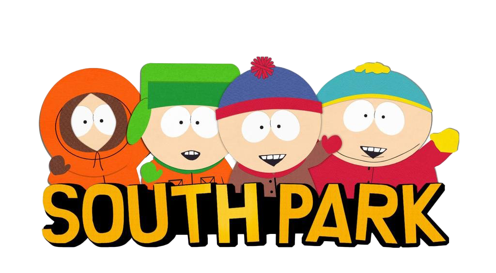
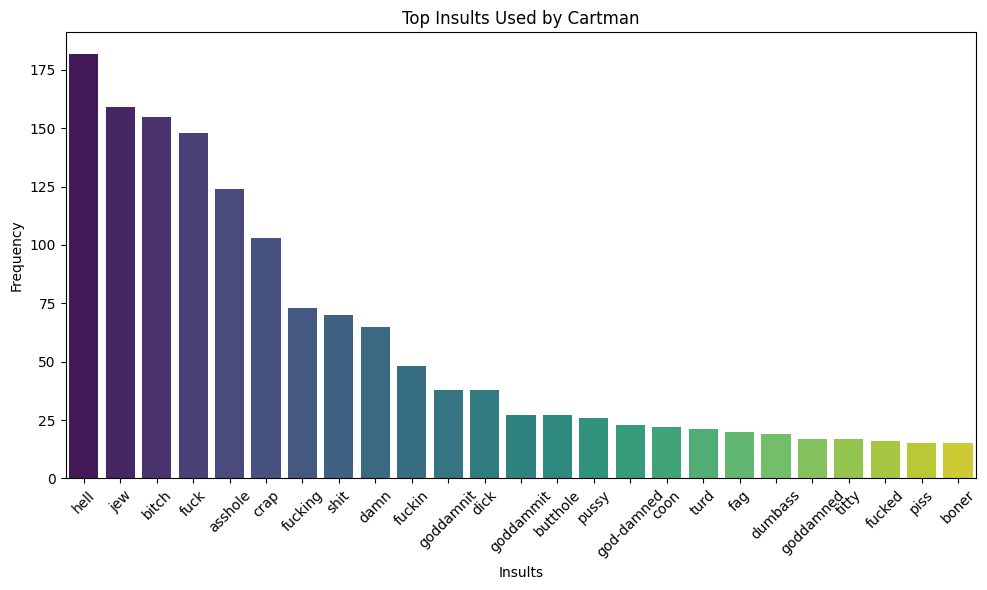

### Script Analysis

This project analyzes and visualizes dialogues from the South Park TV series, focusing on the use of insults throughout the show. The goal is to identify and explore the most frequently used insults in the dialogues across various characters.

---

### Acknowledgements

Thanks to [BobAdamsEE](https://github.com/BobAdamsEE/SouthParkData/) for providing the dataset used in this project. The CSV file containing the scripts played a key role in analyzing the dialogues.

---

### Example

